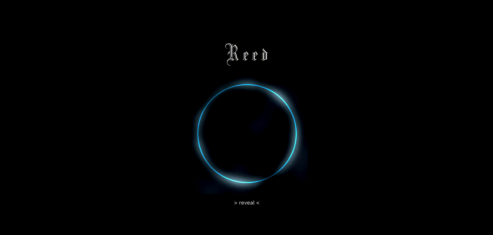
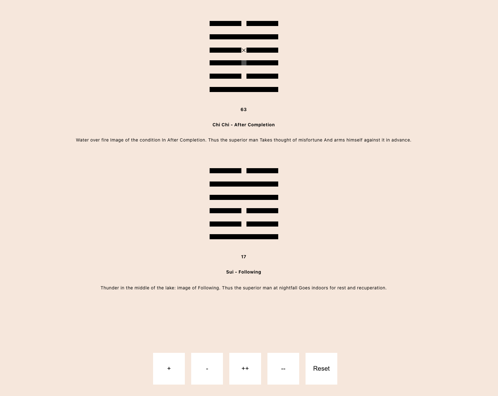
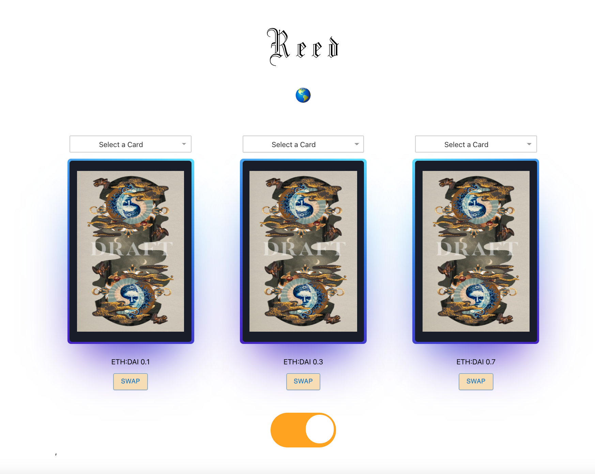
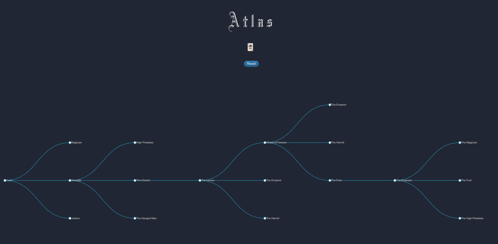
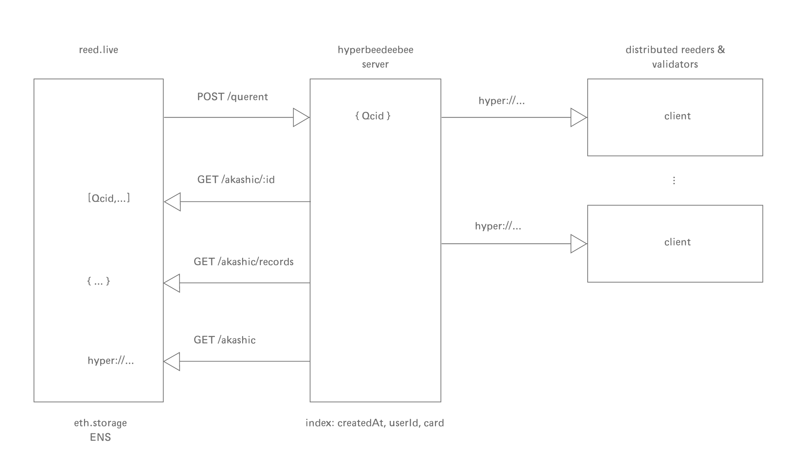

# reed
verifiable oracular readings via I-Ching & Tarot card pulls for private AZTEC uniswap & transparent Optimism trades in DAO governance

# thesis
TBC
current astrological systems are neatly feat into 12 houses and signs. the babylonians negated suchs signs like the 13th constellation where the sun passes through during the times of November 29th - 17th. if a system engages in adoption of this sign, how might time systems unravel itself to accomodate such timely-rollups across micro psyche & macro markets of resource theory?

## 13th Zodiac Sign
// show 12 sign cycle clock
// add galactic 13th
// symbol of medicine
// many groups (?)

## ritual setup
64 angle presevering I-Ching 
256 galactic points, divided by 4 -> 64 possible angles and pairs yin/yang
add 4-sided kaballah tree + crowns

## progression
0. enneagram personality assesment & zodiac interpretation 
1. learning 78 degrees of widsom via tarot embeddings in community archetypal paths
2. completion and extension into 64 genetic binary codons as present + transormation steps
3. vere'd aggregate across community dimensions 

zodiac circle to some tangent, representing sigma (21 in th phoenecian alphabet, which also the world in tarot). In the i-ching, this resolves to cutting Through & Discernment. 

> "Like Alexander the Great cutting the Gordian knot, take decisive action and you will meet with good fortune and even your destiny. Don’t be afraid to shake things up a bit. The ability to take corrective measures when they are needed is an essential trait of leadership."

## endstate
self-contained chaotic attractors aiming for community stability
TODO: add math attractors
TODO: prime distributions

## i-ching

## tarot

# possible optimism integration in light / transparent mode

# decisional trees
constructing decisional uniswap flow trees as to the decisions with capital and liquidity being made through time. can map to DAO members to monitor trust in graphical flows.

78 tarot cards can be applied as a type of antiquity filter on resources

can be performed over ritual periodic timelines beginning from a seed group of individuals as trials for capital efficiency on risk profiles and metaverse journeying

while capital can be hidden, decisions against tarot NFTs not. due to the fact that aztec allws for any ERC20, the pools provided for can become cybernetic magnetic feedback loops constructing live player roles.

# architecture
Technical architecture with reed.live client using [eth.storage](https://eth.storage/javascript#usage) and server indexer using [hyperbeedeebee](https://github.com/RangerMauve/hyperbeedeebee) a hypercore db that stores access to the akashic records for the querents. Enabling networking on a swarm would enable a set of validators to verify time based commitments of readings and vector actions.

# verkle integration

As verkle trees are represented by vectors against the typical merkle tree structure, these vector decisions can be saved as parrallel state roots during certain periods of time, whereby a minimal set of guardians (256) might be promoted on various shards with tarot witnessess. might be interesting to overlap to individuals owning Urbit stars as operators that distribute their reed gateways to hosted planets as a type of authority on treasury holdings to not only technical confidence, but IRL metaverse discernment. as decisions on gateways are mapped, trusted liquidity profiles can create capital drip authorities for basic wellness / income networks.

for now, posting gateway pull decision to textile / storage-js is sufficient. eventually, would like to post verifable videos alongside decisions to skynet, and create an NFC based card deck where reeders can tap to a mobile phone as an easy UX, or, perform readings as NFT mints to recipient travellers as social graph gifts (other planet holders).

Q: 'can we pick apart the liquiduty of markets with a minimal set of widely distributed tarot memes to map meaning while creating micro-identity stability?'

🕵️

~milbyt-moszod research for [matter.direct](http://matter.direct)
