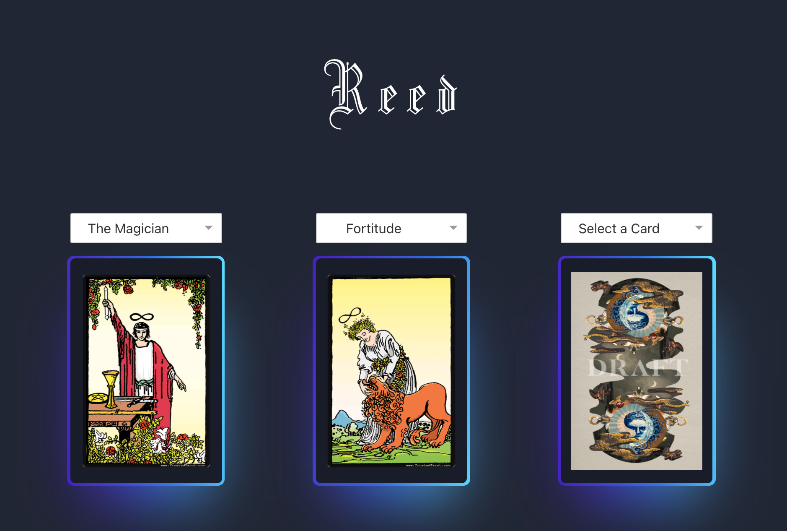
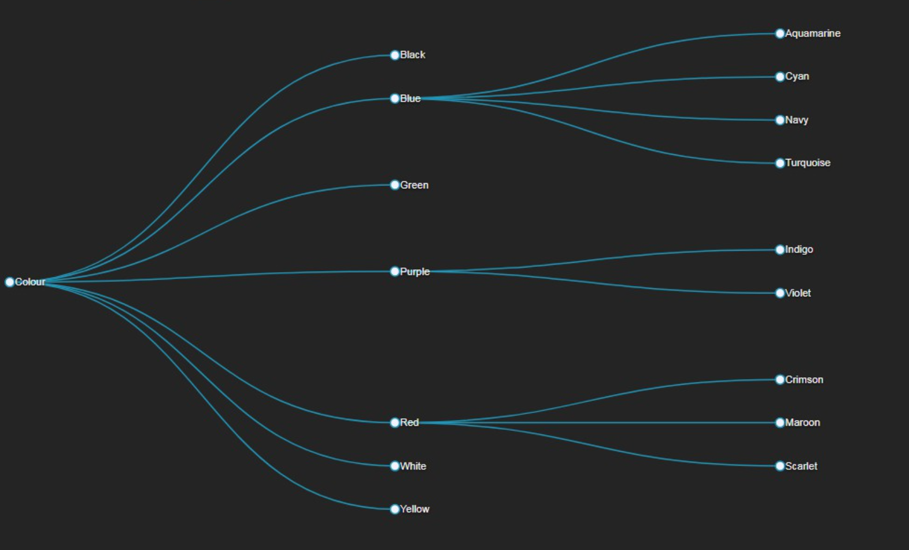

# reed
verifiable tarot card pulls for private AZTEC uniswap trades in DAO governance and exit quits

# decisional trees
constructing decisional uniswap flow trees as to the decisions with capital and liquidity being made through time. can map to DAO members to monitor trust in graphical flows.

78 tarot cards can be applied as a type of antiquity filter on resources

can be performed over ritual periodic timelines beginning from a seed group of individuals as trials for capital efficiency on risk profiles and metaverse journeying

while capital can be hidden, decisions against tarot NFTs not. due to the fact that aztec allws for any ERC20, the pools provided for can become cybernetic magnetic feedback loops constructing live player roles.

# verkle integration

As verkle trees are represented by vectors against the typical merkle tree structure, these vector decisions can be saved as parrallel state roots during certain periods of time, whereby a minimal set of guardians (256) might be promoted on various shards with tarot witnessess. might be interesting to overlap to individuals owning Urbit stars as operators that distribute their reed gateways to hosted planets as a type of authority on treasury holdings to not only technical confidence, but IRL metaverse discernment. as decisions on gateways are mapped, trusted liquidity profiles can create capital drip authorities for basic wellness / income networks.

for now, posting gateway pull decision to textile / storage-js is sufficient. eventually, would like to post verifable videos alongside decisions to skynet, and create an NFC based card deck where reeders can tap to a mobile phone as an easy UX, or, perform readings as NFT mints to recipient travellers as social graph gifts (other planet holders).

Q: 'can we pick apart the liquiduty of markets with a minimal set of widely distributed tarot memes to map meaning while creating micro-identity stability?'

🕵️
